# Wuunder Shipping Plugin Architecture

This diagram shows the architecture and component relationships of the Wuunder WooCommerce shipping plugin.

```mermaid
graph TD
    %% Main Plugin Bootstrap
    MainFile[wuunder-shipping.php<br/>Main Plugin File] --> Plugin[Plugin.php<br/>Core Plugin Class]
    
    %% Core Components
    Plugin --> Admin[WordPress/Admin.php<br/>Admin Interface]
    Plugin --> Assets[WordPress/Assets.php<br/>Asset Management]
    Plugin --> Register[WooCommerce/Register.php<br/>Shipping Method Registry]
    Plugin --> CheckoutHandler[WooCommerce/CheckoutHandler.php<br/>Checkout Processing]
    Plugin --> BlocksIntegration[WooCommerce/BlocksIntegration.php<br/>WooCommerce Blocks]
    Plugin --> SettingsController[Controllers/SettingsController.php<br/>Settings Management]

    %% Settings and API
    SettingsController --> WuunderClient[API/WuunderClient.php<br/>API Communication]
    SettingsController --> CarrierModel[Models/Carrier.php<br/>Carrier Data Model]
    WuunderClient --> |Fetches| APIEndpoint[Wuunder API<br/>api.wearewuunder.com]

    %% Shipping Methods
    Register --> ShippingMethod[WooCommerce/Methods/Shipping.php<br/>Standard Shipping Method]
    Register --> PickupMethod[WooCommerce/Methods/Pickup.php<br/>Pickup Point Method]
    
    %% Database Layer
    CarrierModel --> Database[(WordPress Database<br/>wp_wuunder_carriers)]
    Migrations[Models/Database/Migrations.php] --> Database
    Schema[Models/Schema/AddCarriersTable.php] --> Database

    %% Frontend Assets and Components
    Assets --> AdminJS[assets/dist/js/admin.js<br/>Admin Interface JS]
    Assets --> CheckoutJS[assets/dist/js/checkout.js<br/>Checkout JS]
    Assets --> BlocksJS[assets/dist/js/blocks.js<br/>WooCommerce Blocks JS]
    
    %% JavaScript Components
    AdminJS --> ConnectionTester[JS Components:<br/>- ConnectionTester<br/>- CarrierList<br/>- DisconnectManager<br/>- Validation<br/>- ShippingMethods]
    CheckoutJS --> PickupInterface[Pickup Point Interface<br/>with Iframe Integration]
    BlocksJS --> BlockComponents[Block Checkout Components]

    %% Views and Templates
    SettingsController --> SettingsViews[Views/admin/<br/>- settings-tabs.php<br/>- settings-section.php<br/>- carriers-section.php]
    CheckoutHandler --> FrontendViews[Views/frontend/<br/>pickup-point-display.php]
    
    %% External Services
    PickupMethod --> IframeService[Wuunder Pickup Locator<br/>External Iframe Service]
    
    %% Data Flow
    CheckoutHandler --> |Stores pickup data| WCSession[WooCommerce Session]
    BlocksIntegration --> |Store API Integration| StoreAPI[WooCommerce Store API]
    
    %% Configuration
    MainFile --> Constants[Plugin Constants:<br/>- WUUNDER_PLUGIN_PATH<br/>- WUUNDER_PLUGIN_URL<br/>- WUUNDER_PLUGIN_VERSION]
    
    %% Styling
    classDef coreClass fill:#e1f5fe,stroke:#01579b,stroke-width:2px
    classDef apiClass fill:#f3e5f5,stroke:#4a148c,stroke-width:2px
    classDef jsClass fill:#fff3e0,stroke:#e65100,stroke-width:2px
    classDef dbClass fill:#e8f5e8,stroke:#2e7d32,stroke-width:2px
    classDef externalClass fill:#ffebee,stroke:#c62828,stroke-width:2px
    
    class Plugin,Admin,Assets,Register,CheckoutHandler,BlocksIntegration,SettingsController coreClass
    class WuunderClient,APIEndpoint apiClass
    class AdminJS,CheckoutJS,BlocksJS,ConnectionTester,PickupInterface,BlockComponents jsClass
    class CarrierModel,Database,Migrations,Schema dbClass
    class IframeService,StoreAPI,WCSession externalClass
```

## Architecture Overview

### Core Components

1. **Plugin.php** - Main plugin orchestrator that initializes all components
2. **Admin.php** - Handles WordPress admin integration and activation flows
3. **Assets.php** - Manages CSS/JS asset loading for admin and frontend
4. **Register.php** - Registers custom shipping methods with WooCommerce
5. **SettingsController.php** - Manages plugin settings interface and carrier management

### Shipping Methods

- **Shipping.php** - Standard shipping method using Wuunder carriers
- **Pickup.php** - Pickup point shipping method with location selector

### Data Layer

- **Carrier.php** - Model for carrier data with database operations
- **WuunderClient.php** - API client for communicating with Wuunder services
- **Database migrations** - Handle table creation and schema updates

### Frontend Integration

- **CheckoutHandler.php** - Processes pickup point selection during checkout
- **BlocksIntegration.php** - Integrates with WooCommerce's modern block-based checkout
- JavaScript components for admin interface and pickup point selection

### Key Features

1. **Dynamic Carrier Loading** - Fetches available carriers from Wuunder API
2. **Pickup Point Integration** - Iframe-based pickup location selector
3. **Dual Checkout Support** - Works with both classic and block-based WooCommerce checkout
4. **Settings Management** - Comprehensive admin interface for configuration
5. **Database Storage** - Persistent carrier data with enable/disable functionality

### Data Flow

1. Plugin fetches carriers from Wuunder API
2. Carriers are stored in local database table
3. Shipping methods are dynamically registered based on enabled carriers
4. During checkout, pickup points can be selected via iframe integration
5. Order processing includes pickup point metadata and address updates